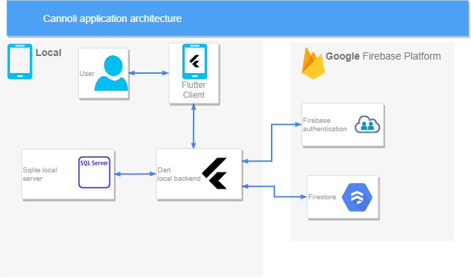
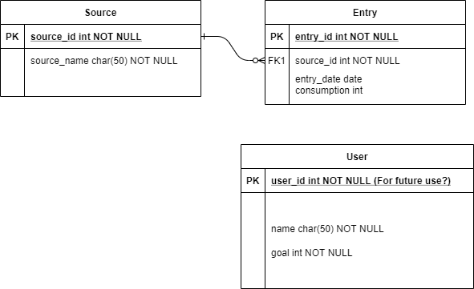

# eco2 tracker

## Documentation

Located at `docs/api`. Generated by `dartdoc`.

https://htmlpreview.github.io/?https://github.com/cannoli-deco/cannoli-app/blob/master/doc/api/index.html

## Architecture

## Schema

## BEFORE YOU PUSH

1. Reformat code. 
    - Android studio / Intellij
        - Run reformat.
2. Check that you are on the correct branch.

## Git guideline

For each feature create a branch `feature/<feature-name>`. Create a pull request to master branch once the feature is completed.
Team members will review your code and merge it.

## How to write docs

https://dart.dev/guides/language/effective-dart/documentation#doc-comments
